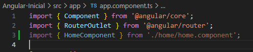

# Manual Angular 2024

## Instalación de CLI angular https://v17.angular.io/cli
* comandos para las versiones:
~~~
$ node -v
v20.16.0
~~~

~~~
$ npm -v
10.8.1
~~~
* verificar - instalar CLI (Intefaz de Linea de Comandos) 
~~~
$ ng --help
bash: ng: command not found
~~~

~~~
$ npm install -g @angular/cli@17
npm warn deprecated read-package-json@7.0.1: This package is no longer supported. Please use @npmcli/package-json instead.

changed 240 packages in 5m
~~~

~~~
$ ng new --help
~~~

## crear un proyecto
~~~
$ ng new primerProyectoAngular
~~~
? Would you like to enable autocompletion? This will set up your terminal so pressing TAB while typing Angular CLI commands will show

? Would you like to enable autocompletion? This will set up your terminal so pressing TAB while typing Angular CLI commands will show

? Would you like to enable autocompletion? This will set up your terminal so pressing TAB while typing Angular CLI commands will show

 possible options and autocomplete arguments. (Enabling autocompletion will modify configuration files in your home directory.) Yes
Appended `source <(ng completion script)` to `C:\Users\Prado\.bashrc`. Restart your terminal or run the following to autocomplete `ng
` commands:

    source <(ng completion script)
? Would you like to share pseudonymous usage data about this project with the Angular Team
at Google under Google's Privacy Policy at https://policies.google.com/privacy. For more
details and how to change this setting, see https://angular.io/analytics. No
Global setting: disabled
Local setting: No local workspace configuration file.
Effective status: disabled
? Which stylesheet format would you like to use? CSS             [ https://developer.mozilla.org/docs/Web/CSS                     ]
? Do you want to enable Server-Side Rendering (SSR) and Static Site Generation (SSG/Prerendering)? Yes
...

CREATE primerProyectoAngular/src/app/app.config.server.ts (361 bytes)
CREATE primerProyectoAngular/src/assets/.gitkeep (0 bytes)
✔ Packages installed successfully.
    Directory is already under version control. Skipping initialization of git.

## Entrar al proyecto
* ingresar al directorio del proyecto
~~~
Prado@DESKTOP-72MFJHI MINGW64 ~/Desktop/Angular/Angular (main)
$ cd primerProyectoAngular/
~~~

* Iniciar servidor ingresar al enlace
~~~
Prado@DESKTOP-72MFJHI MINGW64 ~/Desktop/Angular/Angular/primerProyectoAngular (main)
$ ng serve -o
⠋ Building...
~~~

Application bundle generation complete. [57.592 seconds]

Watch mode enabled. Watching for file changes...
  ➜  Local:   http://localhost:4200/
  ➜  press h + enter to show help

## Lección 1:  [Hola mundo](https://v17.angular.io/tutorial/first-app/first-app-lesson-01)

En el panel Terminal de su IDE:

1. navegue hasta el first-appdirectorio 
2. instalar las dependencias

## Lección 2: Crear componente Inicio

* `selector`: para describir cómo Angular se refiere al componente en las plantillas.
* `standalone`: para describir si el componente requiere un archivo NgModule.
* `imports`: para describir las dependencias del componente.
* `template`: para describir el marcado y diseño HTML del componente.
* `styleUrls`: para enumerar las URL de los archivos CSS que utiliza el componente en una matriz
## Paso 1: crea elHomeComponent
Ejecute este comando `ng generate component home --inline-template --skip-tests` y compilar con `ng serve`
~~~ bash
Prado@DESKTOP-72MFJHI MINGW64 ~/Desktop/Angular/Angular-Inicial (master)
$ ng generate component home --inline-template --skip-tests
CREATE src/app/home/home.component.ts (256 bytes)
CREATE src/app/home/home.component.css (0 bytes)
~~~
## Paso 2: agregue el nuevo componente al diseño de su aplicación

1. Abrir `app.component.tsen` el editor.

2. En `app.component.ts`, importe HomeComponentagregando esta línea a las importaciones a nivel de archivo.

~~~ javascript
import { Component } from '@angular/core';
import { RouterOutlet } from '@angular/router';
import { HomeComponent } from './home/home.component';

~~~

3. En `app.component.ts`, en , actualice la propiedad de la matriz y agregue `.@Component imports HomeComponent`
~~~ javascript
@Component({
  selector: 'app-root',
  standalone: true,
  imports: [RouterOutlet , HomeComponent, ContadorComponent], ......
~~~